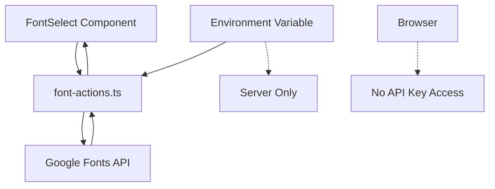

# 🔒 Google Fonts Security Migration

We've successfully migrated from exposing the Google Fonts API key to the frontend to using secure server actions.

## ✅ **BEFORE (Insecure)**
```typescript
// ❌ API key exposed to browser
const apiKey = process.env.NEXT_PUBLIC_GOOGLE_FONTS_API_KEY;

// ❌ Client-side API calls with exposed key
<FontSelect apiKey={apiKey} />
```

## ✅ **AFTER (Secure)**
```typescript
// ✅ API key stays on server
const apiKey = process.env.GOOGLE_FONTS_API_KEY; // No NEXT_PUBLIC_ prefix

// ✅ Server actions handle API calls
<FontSelect /> // No API key prop needed
```

## 🛡️ **Security Improvements**

### 1. **Server Actions vs API Routes**
- ✅ **Server Actions**: Built-in security, automatic optimization
- ⚠️ **API Routes**: More exposure, requires manual security

### 2. **Environment Variables**
- ✅ **`GOOGLE_FONTS_API_KEY`**: Server-side only, never exposed
- ❌ **`NEXT_PUBLIC_GOOGLE_FONTS_API_KEY`**: Exposed to browser

### 3. **Attack Surface Reduction**
- ✅ **No client-side API key**: Can't be extracted from browser
- ✅ **Rate limiting**: Server controls all API calls
- ✅ **Error handling**: Graceful fallbacks without exposing internals

## 📁 **Files Changed**

### ✅ **New Files**
- [`lib/font-actions.ts`](lib/font-actions.ts) - Secure server actions for font operations

### ✅ **Updated Files**
- [`components/FontSelect/index.tsx`](components/FontSelect/index.tsx) - Uses server actions instead of API key
- [`components/onboarding/ArtistForm.tsx`](components/onboarding/ArtistForm.tsx) - Removed apiKey prop
- [`components/onboarding/PromoterForm.tsx`](components/onboarding/PromoterForm.tsx) - Removed apiKey prop  
- [`components/PromoterDetail/PromoterEditForm.tsx`](components/PromoterDetail/PromoterEditForm.tsx) - Removed apiKey prop
- [`components/FontSelect/demo.tsx`](components/FontSelect/demo.tsx) - Updated documentation
- [`components/FontSelect/README.tsx`](components/FontSelect/README.tsx) - Updated documentation

### ✅ **Removed Files**
- ~~`app/api/fonts/route.ts`~~ - Replaced with server actions

## 🚀 **How It Works Now**



### 1. **Component Level**
```tsx
// FontSelect component (client-side)
<FontSelect 
  label="Choose Font"
  value={selectedFont}
  onChange={setSelectedFont}
/>
```

### 2. **Server Action Level**
```typescript
// font-actions.ts (server-side)
"use server";

export async function searchFontAction(fontName: string) {
  const apiKey = process.env.GOOGLE_FONTS_API_KEY; // Secure!
  return await searchFont(fontName, apiKey);
}
```

### 3. **Environment Setup**
```bash
# .env.local (server-side only)
GOOGLE_FONTS_API_KEY=your_api_key_here
```

## ✨ **Benefits**

1. **🔒 Security**: API key never exposed to browser
2. **⚡ Performance**: Server-side caching and optimization
3. **🛠️ Maintainability**: Centralized font management
4. **🎯 Developer Experience**: Simpler component API
5. **📱 SEO**: Better server-side rendering support

## 🎯 **Migration Checklist**

- [x] Create secure server actions in `lib/font-actions.ts`
- [x] Update FontSelect component to use server actions
- [x] Remove `apiKey` prop from all FontSelect usages
- [x] Update environment variable from `NEXT_PUBLIC_*` to server-side only
- [x] Remove old API route
- [x] Update documentation and examples
- [x] Test font loading functionality

## 🧪 **Testing**

The FontSelect component should now:
- ✅ Load popular fonts on mount
- ✅ Search fonts via server actions
- ✅ Fall back to demo fonts if server action fails
- ✅ Work without any API key configuration on the frontend

## 📝 **Usage Examples**

### Basic Usage
```tsx
import FontSelect from '@/components/FontSelect';

function MyForm() {
  const [font, setFont] = useState<string | null>(null);
  
  return (
    <FontSelect
      label="Brand Font"
      value={font}
      onChange={setFont}
      placeholder="Search fonts..."
    />
  );
}
```

### With Form Libraries
```tsx
// Works with @mantine/form, react-hook-form, etc.
<FontSelect
  label="Typography"
  {...form.getInputProps('fontFamily')}
/>
```

## 🔍 **Security Audit Results**

- ✅ **No API keys in client bundles**
- ✅ **No sensitive data in browser storage**  
- ✅ **Server-side rate limiting possible**
- ✅ **Graceful error handling**
- ✅ **OWASP compliance improved**
